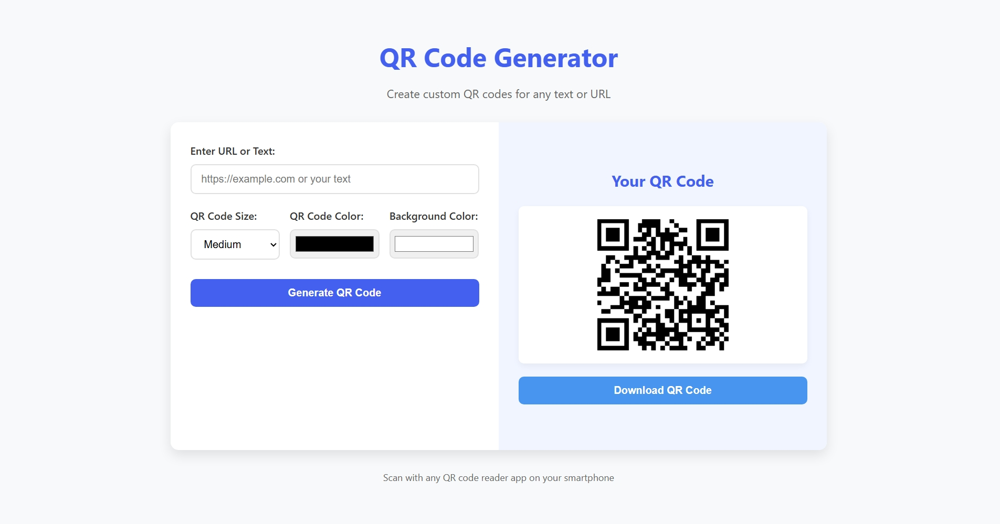

# 🧾 QR Code Generator

A clean, responsive web app that lets you **create custom QR codes** for any text or URL — instantly, right from your browser.  
Built with **HTML, CSS, and JavaScript**, this tool supports **custom sizes, colors, and background themes**, with an option to **download** the generated QR code as a PNG image.

---

## 🚀 Demo

🔗 **Live Website:** [QR Code Generator](https://my-qr-code-generator-1-6.netlify.app/)  

---

## 🧠 Features

- ✏️ Generate QR codes from any **text or URL**  
- 🎨 Customize **QR size**, **foreground color**, and **background color**  
- 💾 **Download** QR code as a PNG image  
- ⚡ Instant **QR preview**  
- 💡 Default example QR on load  
- 🌙 Smooth, modern UI (built from scratch with pure HTML/CSS)  
- 🔍 Works offline once loaded  

---

## 🧩 Tech Stack

| Technology | Purpose |
|-------------|----------|
| **HTML5** | Structure of the app |
| **CSS3 (Flexbox + Variables)** | Styling and layout |
| **JavaScript (Vanilla)** | Logic for generating and downloading QR codes |
| **QRCode.js Library** | Handles QR pattern generation |

---

## ⚙️ How It Works

1. User enters text or URL.  
2. JavaScript reads input and feeds it to the `QRCode.js` library.  
3. The library renders the QR as a `<canvas>` or `` in real time.  
4. You can then **download** it as a PNG using dynamic canvas rendering.

---

## 📸 Preview

  

---

